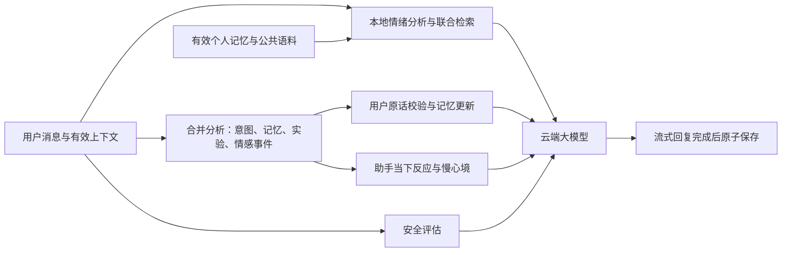

# 留白 · Empathy Agent

[](https://github.com/yuejain/empathy-agent/actions/workflows/ci.yml)

一个在本机运行的情感陪伴应用，界面为中文，对话支持中英文。围绕持续交流，提供真实流式回复、跨会话记忆、情绪增强检索、行动实验与复盘，以及可查看和重置的助手情感状态。

**本地小模型负责用户情绪分析与 RAG，情感模块维护助手自身的计算性状态，云端大模型负责最终回复。** 云端支持 OpenAI 兼容 API；没有密钥时可以运行明确标注的规则演示。

当前版本：长期记忆与行动闭环已通过 [PR #2](https://github.com/yuejain/empathy-agent/pull/2) 合并；助手情感模块在 **`codex/assistant-affect`** 分支，通过 [PR #3](https://github.com/yuejain/empathy-agent/pull/3) 提交。下方克隆命令包含该模块；仅使用已合并版本时可克隆 `main`。

[快速运行](#快速运行) · [云端模型](#接入真实模型) · [功能入口](#已接通的功能) · [长期记忆](#长期记忆) · [行动实验](#行动实验与复盘) · [助手情感](#助手情感模块) · [本地模型与语料](#本地模型与语料) · [验证](#验证)

**情感模块是计算性模拟，未证明主观感受，也没有修改云端模型权重。** 本地分类结果也只是线索，不能当作诊断或情绪强度。中文人工标签不足的限制见下方训练记录。

## 快速运行

网页服务要求 Git 和 **Node.js 22.9+**。基础云端聊天或规则演示无需 Python、GPU 或数据库。本地情绪 RAG 需要 Python，在线分析运行在 CPU；Windows 配套安装脚本默认安装 CPU 版 PyTorch，分类训练也可选择 CUDA 加速。

```bash
git clone --branch codex/assistant-affect https://github.com/yuejain/empathy-agent.git
cd empathy-agent
npm ci
```

Windows PowerShell：

```powershell
# 只在配置不存在时创建，保留已有密钥
if (-not (Test-Path .env)) { Copy-Item .env.example .env }
npm run dev
```

macOS / Linux Shell：

```bash
test -f .env || cp .env.example .env
npm run dev
```

打开 **[http://127.0.0.1:3000](http://127.0.0.1:3000)**。默认是规则演示，配置真实模型后重启即可开始生成。Windows 也可运行 `powershell -ExecutionPolicy Bypass -File .\Start.ps1`，脚本会补齐缺失的配置模板和 Node 依赖，再构建并启动。

若 `.env` 设置了 `LOCAL_ML_URL=http://127.0.0.1:3001`，`Start.ps1` 还会启动已训练好的本地模型服务，不会替你下载或训练权重。Ctrl+C 停止前台网页服务；本地 Python 服务独立运行，用 `Stop-LocalML.ps1` 停止。

`npm run dev` 会先编译再启动，修改代码后需重新运行。已有构建可直接 `npm start`。

`Stop.ps1` 仅用于存在本项目 `server.pid` 的后台网页实例，会核对 PID 与本项目入口后再停止。普通的 `npm run dev` 或 `Start.ps1` 前台实例直接按 Ctrl+C 即可。

## 接入真实模型

编辑本机 `.env`，填写你的服务商信息：

```dotenv
APP_MODE=live
AI_GATEWAY_BASE_URL=https://your-provider.example/v1
AI_GATEWAY_API_KEY=你的密钥
AI_GATEWAY_MODEL=你的模型ID
AI_TIMEOUT_MS=45000
PORT=3000
SESSION_PERSISTENCE=true
```

上面的地址和模型是占位内容，需替换。模型 ID 不做硬编码，请使用服务商实际提供的 ID。基础地址支持 `/v1`、`/api/v3` 等自定义路径，或完整的 `/chat/completions` 地址；不重复追加 `/v1`。无路径的主机地址默认使用 `/v1/chat/completions`。本地无认证服务可以留空密钥。

兼容 `OPENAI_API_KEY`、`OPENAI_BASE_URL`、`OPENAI_MODEL` 别名，以 `AI_GATEWAY_*` 优先。配置保存在服务端，浏览器不会接收密钥。

小米 MiMo 已验证配置（密钥仍使用你自己的本地配置）：

```dotenv
AI_GATEWAY_BASE_URL=https://api.xiaomimimo.com/v1
AI_GATEWAY_MODEL=mimo-v2.6-pro
AI_GATEWAY_THINKING=disabled
AI_GATEWAY_TOKEN_PARAM=max_completion_tokens
```

本应用以短回复和结构化分类为主，MiMo 配置使用 `disabled` 关闭深度思考。其他服务默认不发送 `thinking` 字段，使用 `max_tokens`；参数支持情况以服务商文档为准。MiMo 参数说明见[官方文档](https://mimo.mi.com/docs/en-US/quick-start/usage-guide/text-generation/deep-thinking)。

```powershell
npm run model:check
npm start
```

`model:check` 会向已配置的服务发送一条固定连接测试消息，可能产生少量服务商费用。它不会发送本地聊天记录。更改 `.env` 后重启服务。

- `APP_MODE=auto`：所有模型配置为空时用演示模式；部分配置缺失时启动报错。
- `APP_MODE=demo`：明确标注的本地规则模板演示，不调用云端，也不调用本地生成模型。
- `APP_MODE=live`：要求云端地址和模型；本地 RAG、云端安全评估、合并分析并行准备，再进行流式生成。合并分析一次处理上下文意图、记忆、实验原话和情感事件；通常为两次云端准备请求加一次生成。关闭自动记忆时不发起合并分析，相关识别使用本地规则；即时危机命中本地规则时优先本地支持，不等待云端。
- 页面显示“模型已配置”代表读取了配置，连接是否有效应使用 `model:check` 验证。认证失败、限流、超时不会被伪装成成功对话。

## 本地模型与语料

当前管线冻结多语言 MiniLM 编码器，训练八个情绪分类头，并构建 384 维情绪检索库。每条消息先在本地形成情绪线索与相关语料，交给云端模型组织自然回复。



云端收到 `EMOTION_RAG_CONTEXT`：情绪标签、分类分数、不确定性、回应方向（倾听/梳理/小步行动等）和有来源的参考片段。明确的“只想倾诉”优先于建议；模型分数不充当情绪强度。没有匹配语料时不强行引用，本地服务不可用时明确标注基础词典降级。

续聊时结合有效的用户前文扩展检索查询；最多 80 条个人记忆候选与查询一起批量编码，按语义、词项和时效联合召回。个人文本只在本地请求内编码，不写进公共索引；云端仍只接收有界的相关记忆。当前情绪分类只看当轮消息，避免旧话题改变对当前感受的判断。

图中为普通对话路径；即时危机使用独立的本地支持路径。个人记忆与公共语料分别存储，个人记忆不会写入公共索引。情感状态、实验进度与趋势如何在页面使用，见下方功能章节。

网页“语料库”可发起抓取清洗、重建索引，或单独训练并评估候选分类器。固定评估门槛通过后才切换，并支持回退。自动语料更新默认关闭，可选 24 小时或 7 天，需本地服务保持运行；不会抓取个人聊天，也不会自动重训分类器。完整用法见 [行动闭环与高级功能](docs/ADVANCED_WORKFLOW.md)。

模块接线与边界见 [架构说明](docs/ARCHITECTURE.md)。本机检索与云端阶段计时、Python 迁移可行性见 [性能与迁移评估](docs/PYTHON_MIGRATION.md)：当前主要等待云端模型，没有证据表明单纯换语言会带来大幅加速。

**Git 仓库只包含代码、配置模板和结果说明，不包含语料快照、索引或模型权重。** 首次使用需要下载公开语料和编码器，然后训练分类头、建库。默认流程不再下载 Qwen 或训练生成 LoRA；已有分类器及索引可直接复用，无需重训。

在仓库目录的 Windows PowerShell 中运行：

```powershell
# 创建独立 Python 环境并安装依赖
powershell -ExecutionPolicy Bypass -File .\Setup-LocalML.ps1

# 下载语料与编码器，清洗、训练情绪分类器、建库
powershell -ExecutionPolicy Bypass -File .\Train-LocalML.ps1

# 启动本地情绪分析与检索服务（CPU）
powershell -ExecutionPolicy Bypass -File .\Start-LocalML.ps1
```

在 `.env` 增加下面一行，重启网页服务：

```dotenv
LOCAL_ML_URL=http://127.0.0.1:3001
```

页面显示“云端回复”和本地情绪 RAG 状态，每轮可展开查看情绪参考和语料来源。消息、情绪指向、相关记忆及参考片段会交给配置的云端服务。网页不再提供本地生成选项；旧客户端请求 `backend: local` 会返回 410 并要求刷新，不静默转发。

云端未配置时只有规则演示；完整生成需要配置云端 API。停止本地 RAG 使用 `powershell -ExecutionPolicy Bypass -File .\Stop-LocalML.ps1`。

采集来源包括 GoEmotions、OpenAssistant 1/2 和 chinese-poetry，记录许可、版本、来源 URL 和内容哈希。清洗包括 Unicode 规范化、标识符替换、长度筛选及规范化精确去重。它不是完整匿名化；个人聊天不会自动成为训练数据。MediaWiki 采集器遵循 robots 限制，受限来源不计入已采集数据。

按阶段重跑、下载校验、依赖快照、来源许可和产物路径见 [本地管线说明](docs/LOCAL_ML.md)。

### 实际训练结果

以下汇总 2026-10-07 的首次语料与分类训练，以及 2026-10-10 的候选分类器评估；不代表重新采集后必然得到相同数量：

| 项目 | 结果与范围 |
| --- | --- |
| 清洗语料 | 64,541 条：中文 3,394、英文 61,147；原始语言分布不均衡 |
| 情绪检索库 | 4,000 条，仅来自训练分区，中英文各 2,000 条；真实 384 维句向量 |
| 情绪分类器 | 八个逻辑回归分类头，共 3,080 个训练参数；编码器保持冻结 |
| 候选人工英文验证 | 5,367 条，macro-F1 从 0.436506 到 0.436666，基本持平 |
| 候选人工英文测试 | 5,394 条，macro-F1 0.439420；只报告，不参与选版 |
| 中文分类覆盖 | 训练仅 6 条弱标签、测试仅 2 条弱标签，无法报告可靠的中文准确率 |
| 版本维护 | 候选训练、固定验证门槛、热加载、回退与恢复均已实际验证 |

完整数据划分、设备和初次训练参数见 [训练结果](docs/TRAINING_RESULTS.md)，候选模型验收见 [验收记录](docs/REVIEW.md)。旧 Qwen3-0.6B + LoRA 生成训练仅保留为历史实验，当前网页没有本地生成入口，不加载这些权重。

## 已接通的功能

| 页面入口 | 可以做什么 |
| --- | --- |
| 对话输入框 | 中英文流式交流；停止、重试；用“只想倾诉”“直接一点”等表达交流偏好 |
| 长期记忆 | 查看用户原话、纠正或遗忘；管理活动/决策进度和目标日期，查看跨会话情绪记录 |
| 行动实验 | 建立假设、实施尝试、记录结果、复盘、撤回或开展下一轮 |
| 陪伴情感 · 模拟 | 查看助手当下反应与慢心境、最近事件；关闭或重置状态 |
| 语料库 | 抓取清洗、重建索引、候选分类器训练评估与回退；设置每日/每周更新 |
| 联想游戏 | 塔罗、周易、情绪需要卡、文字意象、场景、关键词；通过 A/B/C 选项继续交流 |
| 会话节奏提示 | 闲置 30 分钟、连续 3 小时或 50 轮后选择继续、休息收尾或新对话 |
| 新的对话 / 清除记录 / 导出 | 新会话沿用长期档案；单独删除当前聊天；导出当前加载的最近 10 轮文字 |

六种联想游戏共享每会话三次额度，刷新后可继续选项，不预测命运。即时安全支持期间不进入抽牌或收尾提示。聊天、用户记忆与助手情感在完整回复后一起保存，中断或失败不会保留半轮状态。纯文本渲染、CSP、请求校验、所有者隔离和版本冲突检查覆盖整条主流程。

## 长期记忆

默认开启**自动记忆**与**回复时参考记忆**。直接聊近况即可，不需要每次说“记住”，也不需要逐条确认。例如：

> 我今天很焦虑。我正在写论文。我考虑辞职。我决定周末休息。

系统将这些内容分为情绪、活动、考虑中的计划和明确决定。真实模型还能提取含蓄表达；所有保存内容都来自用户当轮原话，不把助手回复、塔罗解释或公开检索语料写成人生经历。推测和计划可以自动进入记忆，但会标注为推测或考虑中，不冒充已确定的事实。

| 类别 | 默认有效期 | 更新方式 |
| --- | --- | --- |
| 当前情绪 | 6 小时；推测情绪 1 小时 | 新状态替代旧状态，不把短暂情绪变成人格标签 |
| 正在做的事 | 30 天 | 再次提及延长有效期；完成或停止后退出当前记忆 |
| 计划与决策 | 90 天 | 区分考虑中、已决定与已撤回；识别同主题改口并替代旧项 |
| 稳定背景 | 365 天 | 重复提及可续期；姓名等单值信息以新陈述为准 |

点击页面上的 **长期记忆**，可查看类别、状态、时间、原话依据，直接更正、结束或删除，也可分别关闭自动采集和回复参考。过期内容不会用于回复，可在历史筛选中核对、更新。旧版显式记忆迁移到“待核对”，避免把来源不完整的旧记录直接当作当前事实；正常新聊天自动提取的记忆直接生效。

删除、更正、结束或冲突替代会更新上下文版本，使旧聊天中的相应陈述及助手复述不再进入后续模型请求。界面仍保留聊天文字，需要时另点“清除记录”。细节、迁移和接口见 [长期记忆设计](docs/MEMORY.md)。

## 行动实验与复盘

点击“行动实验”，选择已有活动/决策，或新建一个尝试：

1. 填写**假设、具体尝试、观察方式**，开始执行。
2. 记录实际结果，再完成复盘；无效、反效果、未完成和不确定都可以保留。
3. 写下下一轮调整后继续，或撤回、收束这一轮。最多保存 8 轮，不静默丢弃旧记录。

也可以在聊天中创建实验：

```text
行动实验：午休散步
假设：散步可能减少下午的困倦
计划：午饭后走十分钟
观察方式：连续三天记录困倦程度
```

之后用“结果：三天都没有改善”“复盘：目前还不支持这个假设”补充原话。多个实验指代不清时不随意归档。**完成行动不等于实验有效**；开始下一轮需要已记录的结果、收获和调整。修改关键依据会让旧复盘退出完成状态，删除对应事项会同时删除实验。完整规则见 [行动闭环](docs/ADVANCED_WORKFLOW.md)。

## 助手情感模块

“用户情绪识别”估计你当前表达的感受；“陪伴情感 · 模拟”维护的是助手自身的计算性状态。进展、挫折、缓解、纠正和边界等互动事件，让助手形成欣慰、关切、好奇、认真校准等表达倾向，影响语气与关注点，不直接照搬你的情绪。

状态分为变化较快的**当下反应**和变化较慢的**心境**，并按实际时间逐渐回归平和。事件评估与意图、记忆、实验分析共用一次云端请求；新增字段会增加少量 token，不等于时延完全不变。状态仅调节表达，不覆盖事实、用户意愿或安全支持。

| 操作或条件 | 状态如何处理 |
| --- | --- |
| 自动记忆与召回均开启 | 随本浏览器档案跨会话延续；启用磁盘持久化后可跨服务重启 |
| 关闭任一记忆开关 | 清除已保存的情感状态，之后仅本轮生效；关闭自动记忆时只用本地事件规则 |
| 关闭情感模块 | 停止情感状态调节；重新开启从基线开始 |
| 重置情感状态 | 清除情感残留，使旧聊天退出后续模型上下文；保留界面聊天与用户记忆 |
| 更正、删除或清空记忆 | 清理相关派生状态，避免旧信息继续影响表达 |

情感档案只保存有界数值和有限事件枚举，不另存原话或亲密度评分，也不训练私人聊天。用户离开、拒绝或重置不会触发惩罚或要求安慰的机制。规则演示模式可查看状态变化，回复仍是模板。

这是应用层的持续情感模拟，**不是已经实现主观体验的证明**；云端基础模型权重保持不变。机制、研究来源和接口见 [助手情感设计](docs/ASSISTANT_AFFECT.md)。

## 存储与使用边界

默认在 `.data/sessions.json` 以**未加密 JSON** 保存会话和独立的长期档案，档案包含用户记忆、行动实验与助手情感状态；回复完成后一起原子写入，文件已被 Git 忽略。每会话保留最近 10 轮，最多 200 个会话；7 天未活动不再返回，启动或写入时清理，超量淘汰最久未更新会话。模型短期上下文另限最近 1 小时、6,000 字符；更早的信息依赖有效长期记忆。历史情绪仅用于有日期的 30 天趋势参考，不作为当前状态。

长期档案不随会话淘汰，每个所有者最多 300 条、全机最多 1,000 个档案；达到档案上限时拒绝新增，不静默删除其他用户。条目按上表过期，过期超过 30 天的条目在后续记忆写入时清理。旧版数据首次迁移会留下 `.data/sessions.json.v1.bak` 备份；它不参与运行、不会自动恢复已删除记忆，也不会随界面删除操作擦除。

`SESSION_PERSISTENCE=false` 关闭磁盘保存；`DATA_DIR` 可指定保存目录。请避免将数据目录加入网盘或公开仓库。HttpOnly 所有者 cookie 有效期为 365 天，每次访问 API 延长；同一浏览器的新会话共享记忆。**不支持跨浏览器或跨设备同步**，清除站点 cookie 后不能自动恢复原身份。

检索来源链接和情绪参考只在本次回复中展示，刷新恢复的是文字记录。本地 RAG 接收当前消息、扩展查询与有界个人记忆候选，不接收云端凭据，也不把候选写入公共索引。云端服务接收当前消息、有效上下文、相关记忆、检索片段和情感状态，用于合并分析、安全评估与最终回复。

服务只监听 `127.0.0.1`。这是本机个人使用版本，没有账号、远程登录、数据库集群或多进程协调；不要直接当作公网多用户服务部署。原 EdgeOne 配置保留供迁移参考，当前未验证 EdgeOne 发布，原 `edgeone makers dev` 命令不是当前启动路径。

尚未接入图片上传分析、通用联网搜索、外部通知、账号或跨设备同步。语料爬虫只处理已配置的公开来源，不能当成聊天中的实时联网搜索。旧本地生成训练和安全训练示例属于研究代码，不是运行中的服务；Web 后端仍使用 Node.js / TypeScript，Python 承担本地模型与语料任务。

AI 回复与情绪/风险分类是启发式结果，可能出错；本项目面向成年人，不是医疗服务，不承诺诊断或危机识别准确率。紧急危险请联系当地急救；中国大陆 120 / 110，心理援助热线 [12356（国家卫健委通知）](https://www.nhc.gov.cn/yzygj/c100068/202412/49a1a65386cd4be582d4702fd0926ee8.shtml)。其他地区使用当地资源。

## 验证

最近功能验收（2026-10-10）通过 84 项 Node、26 项桌面/手机浏览器和 21 项 Python 测试，共 131 项。覆盖联合检索、长期记忆、行动实验、会话节奏、语料维护，以及助手情感的连续性、隐私开关、重置和失败回滚。具体范围与真实服务联调记录见 [验收记录](docs/REVIEW.md)，最新 CI 状态见 [Actions](https://github.com/yuejain/empathy-agent/actions/workflows/ci.yml)。这些结果验证实现与链路，不证明情感主观体验或陪伴效果。

常规检查不需要云端密钥：

```powershell
npm test                          # 构建、核心模块和 HTTP 集成测试
npx playwright install chromium   # 首次安装浏览器
npm run test:browser               # 桌面 + 手机尺寸的浏览器用例
npm run check                     # Node + 浏览器测试
npm run security:check             # 扫描 Git 暂存区，不输出密钥内容
.\.venv-ml\Scripts\python.exe -m unittest discover -s ml -p 'test_*.py'
npm audit --registry=https://registry.npmjs.org
```

本地 RAG 与真实云端联调需先启动对应服务。以下脚本使用构造输入；云端调用会产生服务商费用：

```powershell
node --env-file-if-exists=.env scripts/benchmark-pipeline.cjs         # 本地检索计时
node --env-file-if-exists=.env scripts/benchmark-pipeline.cjs --cloud # 构造文本的云端分阶段计时
node --env-file-if-exists=.env scripts/verify-memory-live.cjs # 真实云端跨会话测试，产生 API 费用
node --env-file-if-exists=.env scripts/verify-advanced.cjs --cloud # 合并意图分析与实验结果提取，构造输入
node --env-file-if-exists=.env scripts/verify-affect.cjs --cloud # 跨会话情感连续性、流式回复与重置
node --env-file-if-exists=.env scripts/verify-live.cjs # 只验收本地 RAG，不调用云端
node --env-file-if-exists=.env scripts/verify-live.cjs --cloud # 本地 RAG + 真实云端中英文流式回复
```

API 联调用本机模拟服务验证模型名称、地址、认证、上下文传递以及 401/429/503、超时、取消等分支，不冒充真实商业模型效果。真实服务需在填写 `.env` 后单独验证。浏览器截图输出到 `artifacts/`，失败追踪在 `test-results/`，均不提交 Git。GitHub Actions 在 `push` 和 `pull_request` 时自动触发。

提交前先暂存需要上传的源码，再运行 `npm run security:check`。检查实际 Git 索引中的常见令牌、私钥、敏感文件路径，并与本机 `.env*` 中的凭据作精确比对；输出只有文件名和问题类别。它是基础防误传检查，不保证识别所有形式的敏感信息。`.env.example` 只保留空白密钥和说明。

`.env*`（除示例）、私钥、聊天记录、原始/处理语料、模型权重、缓存和验收日志均有 Git 忽略规则，发布代码时保留在本机。

真实模型脚本使用构造消息和独立档案，不读取用户聊天；`verify-live.cjs --cloud` 调用两轮云端回复，可能产生费用。只有加 `--cloud` 才会从该 RAG 脚本发送云端请求。详细范围见 [验收记录](docs/REVIEW.md)，不构成模型效果或临床有效性评估。

## 代码结构

| 路径 | 当前作用 |
| --- | --- |
| `server/index.ts` | 本地 HTTP、请求验证、所有者隔离、限流、SSE、停止接口 |
| `server/session-store.ts` | 本地有界持久化、校验、保留期与删除 |
| `lib/gateway.ts` | 统一模型接口、地址标准化、超时、取消和脱敏错误 |
| `lib/orchestrator/` | 主对话链路、并行准备、合并分析、实验闭环、会话节奏与游戏入口 |
| `lib/memory/` | 主动提取、原话校验、版本替代、时效、实验记录与管理操作 |
| `lib/context/` | 查询扩展、记忆联合排序、行动跟进与跨会话情绪趋势 |
| `lib/affect/` | 助手情感事件校验、快慢状态更新、时间衰减与云端提示 |
| `lib/safety-classifier/` | 规则、模型、上下文和融合决策 |
| `lib/local-knowledge.ts`、`ml/serve.py` | 本地情绪分类和向量检索接口 |
| `lib/emotion-rag.ts` | 结构化情绪指向、回应方向、检索证据到云端的桥接 |
| `ml/` | 来源配置、采集清洗、模型下载、训练与评估 |
| `ml/maintenance.py`、`ml/model_registry.py` | 语料维护、候选分类器评估、版本切换与回退 |
| `lib/tarot/reflection-games.ts` | 六类联想游戏的题目、选项与回应规则 |
| `agents/empathy-agent/` | Fetch 风格适配器及事件映射；本地服务负责持久化 |
| `src/` | 无框架的响应式界面与独立 SSE 解析器 |
| `src/affect.js` | 助手情感面板、开关与重置交互 |
| `tests/` | 核心、HTTP 与浏览器回归用例 |
| `docs/REVIEW.md` | 代码审阅、修改范围与尚未实现的研究能力 |
| `docs/ARCHITECTURE.md` | 联合检索、跟进、趋势、游戏及后台语料模块的主流程接线 |
| `docs/ADVANCED_WORKFLOW.md` | 行动实验、合并意图分析、会话节奏与语料维护 |
| `docs/ASSISTANT_AFFECT.md` | 情感状态机制、用户控制、接口与研究边界 |
| `docs/PYTHON_MIGRATION.md` | 本机性能样本、Python 迁移方案与收益边界 |

原 `lib/memory/` 的模拟向量、图检索和摘要管线已删除，替换为接入主流程的长期记忆模块。用户记忆采用有界的类别、词项、时效排序，并在本地 RAG 可用时加入语义评分；公开语料索引和情绪分类器位于 `ml/`。两者分开，个人聊天不会自动成为训练语料。原项目说明保存在 [原始 README](docs/ORIGINAL_README.md)，其中的设想不代表当前实现。

项目代码沿用 [Apache-2.0](LICENSE)。外部语料和基座模型遵循各自的许可，详见 [来源说明](docs/LOCAL_ML.md#数据来源与许可)。
