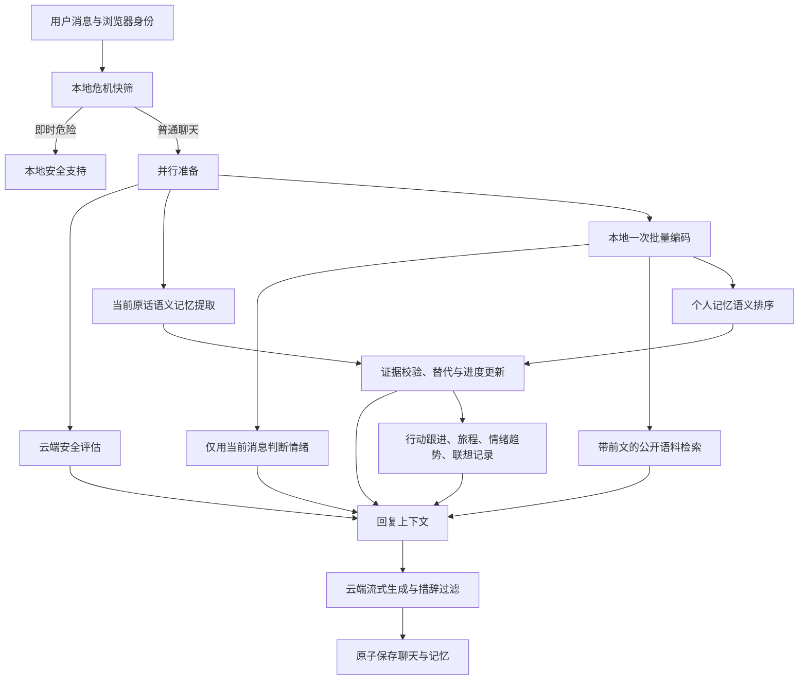

# 持续陪伴主流程与模块接线

## 一轮对话

明确记忆命令、抽卡和 A/B/C 选择由本地处理，不调用云端；本地危机快筛总在外部请求之前。普通轮次云端安全与语义提取并行，若安全评估要求阻断，提取结果丢弃。停止、断流和写盘失败均不提交轮次副本。

## 模块与职责

| 模块 | 主流程入口与行为 |
| --- | --- |
| `context/retrieval.ts` | 有效短期上下文最多 6,000 字符；续聊补充最近有效用户表达，避开助手建议、记忆命令和风格反馈；选择最多 80 条个人记忆候选 |
| `local-knowledge.ts` / `ml/serve.py` | 同一编码器批量处理当前消息、扩展查询和候选；情绪分类只看当前消息；个人文本仅在请求内使用，响应只给 ID/分数 |
| `memory/retrieval.ts` | 词项、语义、类别与时效联合排序；再次过滤候选身份、有效期与状态，最多 6 条、1,800 字符 |
| `memory/follow-up.ts` | 计划、进行中、受阻、完成、撤回；明确主题或唯一/明确焦点才能关联“那个完成了”；面板允许更新进度与目标日期 |
| `memory/experiments.ts` | 实验字段证据、五种周期状态、逐轮复盘及调整；附属于记忆条目，删除/更正不留另一份缓存 |
| `memory/extractor.ts` | 一次云端准备请求返回记忆、上下文意图和已有实验的原话更新；不再独立调用意图模型 |
| `orchestrator/journey-policy.ts` / `session-health.ts` | 限制自动探索深度，明确意愿优先；会话健康交互支持继续、收尾、新会话 |
| `emotion-tracker.ts` | 从记忆证据重算 30 天情绪记录；同一会话同一 UTC 日只保留最新观察；至少 3 条明确自述、2 个会话、2 天才描述趋势 |
| `context/continuity.ts` / `journey-tracker.ts` | 从有效事项、已完成事项和用户明确的方向陈述计算陪伴阶段；新对话可接续事项；用户明确复盘和完成报告进入复盘阶段 |
| `intent/router.ts` | 意图提示参与回复；沟通风格反馈从有效记忆重建，支持直接、简短、详细、温和、减少/恢复追问 |
| `empathy-decision.ts` | 复用共情策略表及输出过滤；阶段与安全的最终决定统一由编排器负责，避免两个状态机互相覆盖 |
| `tarot/interaction.ts` / `reflection-session.ts` | 六种联想入口统一生命周期；选项、选择、跳过、1 小时有效期和刷新恢复；状态写入会话，不再维护另一份进程内塔罗档案 |
| `tarot/narrative.ts` | 仅汇总用户在联想后亲自表达且已进入有效记忆的内容；不从牌面推断人格。偏好来自明确陈述，不强推游戏 |
| `ml/maintenance.py` | 网页发起抓取/清洗/重建，单任务及跨进程文件锁；自动更新默认关闭，可选 24/168 小时；只处理公开数据 |
| `ml/build_index.py` | 不可变版本目录、完整哈希校验、原子切换指针；服务下次检索时热加载；无效新版保留上一份已加载索引 |
| `ml/model_registry.py` | 固定验证门槛、分类头版本发布、完整性检查与上一版回退；测试集仅报告，私人聊天不训练 |

旧版塔罗独立缓存已合并；旧 `EmotionTracker`、概率矩阵、`lib/safety.ts`、第二套共情决策、单独云端情绪/意图分析和无效意图历史配置现已移除。旧 TypeScript 导出不再保留，仓库内调用已迁移。卡牌数据与匹配器继续使用。通用安全训练脚本仍是研究框架，不再从运行库聚合导出；没有把它当作已训练的风险模型接入。旧本地生成实验和 EdgeOne 示例也不参与运行。

## 删除与隔离

长期记忆是衍生信息的唯一数据源。行动进度附在对应条目；趋势、偏好和联想叙事读取时重算。删除、更正、关闭参考或清空后，不会从独立画像缓存恢复旧结论。历史情绪仅在明确标注日期的趋势段落中使用；被替代的情绪不进入当前状态召回。公开语料不进入个人记忆，也不会因个人对话改变索引。

UI 管理界面可查看全部记录；云端只接收有界的当前上下文、相关记忆、跟进参考和公开片段。合并分析接收当前原话、最多 20 条背景及最近 6 条有效历史（每条最多 700 字符），历史只帮助理解意图和指代；写入依据必须来自当前用户原话。实验上下文另限最多 3 项、2,600 字符。完整状态约束见 [ADVANCED_WORKFLOW.md](ADVANCED_WORKFLOW.md)。

## 效率与范围

新增 `ai_response.timings` 给出准备、检索、安全、提取、上下文组装、首段文字和生成耗时；它们是相互重叠的阶段，不能相加作为总耗时。`ai_response.retrieval` 标明语义联合/词项降级、是否扩展查询及候选/召回数量。命令与游戏没有生成耗时字段。

索引更新是后台流程，不能占据聊天请求。第一次加载/热切换会做哈希校验；常规轮次复用编码器及公共向量。个人向量不跨请求缓存，优先避免删除后遗留私人索引。当前 80 条候选上限意味着超过 80 条有效记忆时，较老且词项无关的事实可能未进入语义排序。用户可更正、置顶式重新陈述或直接提及主题；尚无已验证的全量个人检索召回率保证。

本版本不提供账号跨设备同步、外部提醒推送、真实图片上传分析、通用联网搜索或独立训练的安全模型。意象入口使用文字画面。自动语料更新只在本地服务运行时工作，不会开启系统常驻计划任务。不要同时运行离线训练/采集 CLI 与网页更新任务。
